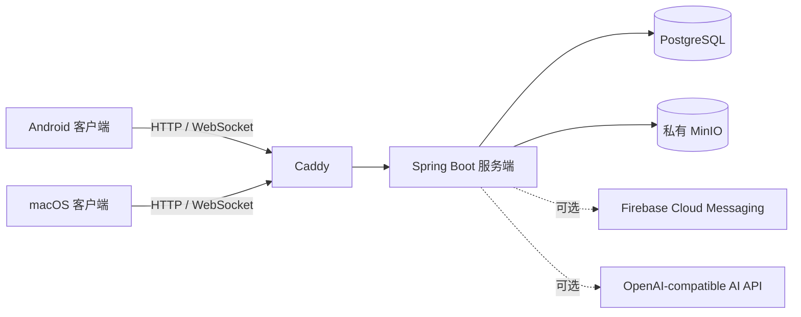

# 即通

即通是一个面向 Android 与 macOS 的即时通信项目。当前仓库同时包含客户端、服务端、接口契约、部署配置和验收脚本，目标是提供可自托管的私聊与群聊体验，并在明确授权的前提下提供私有 AI 助手能力。

项目仍在持续开发中。下面的说明以当前仓库代码和文档为准，适合第一次了解项目、启动本地环境或准备部署的开发者。

## 项目在做什么

即通围绕几个核心场景展开：

- 用户通过公开注册获得账号和不可变的账号编号。
- 用户可以搜索、添加联系人，进行一对一文本和图片消息通信。
- 用户可以创建和管理群组，处理邀请、入群申请、成员角色、封禁和群组资料。
- 同一账号可以管理多个设备，客户端支持消息同步、已读状态、断线重连和本地离线队列。
- Android 客户端可接入 Firebase Cloud Messaging，在后台接收消息提醒。
- 用户或群组在获得相应授权后，可以使用 AI 生成会话摘要、智能回复建议、行动项和关键信息提取结果。

AI 结果以异步消息的形式返回，不会代替用户自动发送消息。私聊 AI 需要会话双方同意，群聊 AI 需要群组策略允许；服务端还会限制上下文范围、预算和并发，避免把聊天内容无边界地交给模型。

## 当前仓库包含什么

| 部分 | 技术与职责 | 当前定位 |
| --- | --- | --- |
| Android 客户端 | Kotlin、Jetpack Compose、Room/SQLCipher、Android Keystore | 移动端消息、联系人、群组、同步和推送体验 |
| macOS 客户端 | Kotlin Multiplatform、Compose Desktop、H2、macOS Keychain | 桌面端消息、联系人、群组和私有 AI 体验 |
| 服务端 | Spring Boot、Flyway、PostgreSQL、WebSocket | 身份、设备、消息、群组、同步、媒体、AI 和管理接口 |
| 对象存储 | 私有 MinIO | 图片、头像等媒体文件的存储 |
| 入口与部署 | Caddy、Docker Compose | 本地开发入口、生产 HTTPS/WSS 和单节点部署 |
| 接口契约 | OpenAPI 3.1 | 客户端与服务端共享的 v1 接口基线 |

## 产品架构

生产环境的外部入口只有 Caddy。Caddy 负责 HTTPS/WSS 终止和反向代理，Spring Boot、PostgreSQL 与 MinIO 位于内部网络，不直接暴露到公网。



服务端是状态和权限的权威来源，客户端负责交互、缓存和本地体验。消息进入服务端后分配服务端序列号，客户端通过同步流和确认机制补齐缺失消息；媒体文件走私有对象存储，数据库只保存元数据和引用。

## 已覆盖的能力

### 账号、设备与安全

- 公开注册、登录、刷新令牌、登出、修改密码和注销账号。
- 多设备会话、设备替换确认、设备级推送令牌管理。
- 服务端统一鉴权、错误响应、审计日志、滥用举报和管理员处置接口。
- Android 本地数据使用 SQLCipher 与 Android Keystore；macOS 客户端使用加密 H2 与 macOS Keychain 保存敏感信息。

### 联系人与会话

- 用户搜索、可搜索性设置、联系人申请、联系人列表和拉黑。
- 一对一会话与群组会话。
- 文本消息、图片消息、图片上传下载、头像和群组头像。
- 已读状态、历史同步、断线重连、消息撤回和服务端审核后的消息墓碑。

### 群组

- 创建群组、邀请成员、处理入群申请和生成群邀请。
- 成员角色、群主转移、成员禁言或封禁、群组搜索和群组资料维护。
- 群组头像以及群组级 AI 策略。

### 私有 AI 助手

- 会话摘要。
- 智能回复建议。
- 行动项提取。
- 关键信息提取。
- 私聊双方同意、群组策略、上下文边界、预算和异步结果通知。

AI 和 FCM 都属于可选外部依赖，默认配置不会自动启用它们。具体开关、权限边界和数据流请先阅读[系统技术设计](docs/design/im-system-technical-design.md)。

## 快速开始

### 运行服务端与基础设施

开发环境约定是 JDK 21、仓库内 Maven Wrapper、Docker Compose 和 macOS 上的 Colima。先完成环境检查，再启动本地服务：

```bash
./scripts/dev-env.sh --check
./scripts/dev-up.sh
```

本地服务启动后，可以检查健康接口：

```bash
curl http://127.0.0.1:8080/api/v1/system/health
```

运行服务端验证和契约测试：

```bash
./scripts/dev-env.sh ./mvnw verify
```

运行标准冒烟流程：

```bash
./scripts/dev-smoke.sh
```

开发环境、端口、Colima、Compose 和常见故障处理统一见[开发环境与启动约定](docs/development-environment.md)。停止本地容器并保留数据卷可运行：

```bash
./scripts/docker-runtime.sh docker compose --env-file .env down
```

### 运行 Android 客户端

Android 客户端默认把 Android Emulator 的 `10.0.2.2:8080` 作为本机服务端地址。服务端已启动后：

```bash
cd android-app
./gradlew assembleDebug \
  -PjitongBaseUrl=http://10.0.2.2:8080/
```

也可以直接用 Android Studio 打开 `android-app` 运行 Debug 变体。真机调试时，把 `jitongBaseUrl` 改成开发机在局域网内可访问的地址。模拟器网络、清库、推送和验收流程见[Android 模拟器联调](docs/android-emulator.md)，客户端配置和发布参数见[Android 客户端说明](android-app/README.md)。

### 运行 macOS 客户端

macOS 客户端默认连接 `https://127.0.0.1:8443`。本地开发服务端直接监听 HTTP `8080` 时，可以显式覆盖地址：

```bash
cd desktop-app
JITONG_SERVER_URL=http://127.0.0.1:8080 ./gradlew run
```

运行桌面端测试：

```bash
cd desktop-app
./gradlew test
```

更多客户端能力、数据存储和打包说明见[macOS 客户端说明](desktop-app/README.md)。

## 部署与发布

当前正式部署目标是单节点 Docker Compose。它适合内部试用、小规模自托管和验收环境，明确接受单节点故障范围；仓库目前没有把 Kubernetes 或高可用集群作为默认部署形态。

生产拓扑、环境变量、域名、TLS、初始化、升级、回滚、备份和恢复见：

- [单节点生产部署](docs/deployment.md)
- [备份与恢复](docs/backup-restore.md)
- [发布、安装与升级](docs/release.md)

发布脚本会构建服务端、可选的 Android APK 和 macOS DMG，并把 Compose、Caddy 和部署所需文档整理成可交付目录。执行前请先阅读发布说明：

```bash
./scripts/release/build.sh --help
```

生产环境至少需要准备公网域名、HTTPS 证书策略、PostgreSQL 与 MinIO 的加密备份位置，以及 Android 推送或 AI 服务所需的外部凭据。生产环境变量以 `.env.example` 和[单节点生产部署](docs/deployment.md)为准，不要把真实密钥提交到仓库。

## 文档地图

如果你第一次参与项目，建议按下面的顺序阅读：

1. [项目上下文](CONTEXT.md)，了解产品边界、术语和当前阶段。
2. [系统技术设计](docs/design/im-system-technical-design.md)，了解产品架构、数据模型、协议、安全边界和验收目标。
3. [开发环境与启动约定](docs/development-environment.md)，准备本地环境并启动服务。
4. [接口契约](contracts/openapi-v1.yaml)，查看客户端和服务端共享的 API 基线。
5. [Android 客户端说明](android-app/README.md)与[macOS 客户端说明](desktop-app/README.md)，了解各端运行和发布方式。
6. [单节点生产部署](docs/deployment.md)、[备份与恢复](docs/backup-restore.md)与[发布说明](docs/release.md)，准备交付或部署。

仓库还维护了 ADR、Android 联调说明、验收脚本说明和 Issue 流程。完整索引见[仓库协作约定](AGENTS.md)。

## 目录结构

```text
.
├── android-app/       Android 客户端
├── desktop-app/       macOS Compose Desktop 客户端
├── src/                Spring Boot 服务端源码
├── client-shared/      客户端共享模型与协议代码
├── contracts/          OpenAPI 与协议契约
├── config/             应用配置
├── infra/              基础设施配置
├── docs/               环境、设计、部署、发布与验收文档
├── compose.yaml        本地 Docker Compose 基础配置
├── compose.production.yaml
├── Caddyfile           本地入口配置
└── scripts/            开发、验收、备份和发布脚本
```

## 当前边界

- 项目仍处于持续开发阶段，接口和客户端交互可能随迭代调整。
- 当前推荐的服务端交付方式是单节点 Docker Compose，生产环境需要自行规划域名、证书、备份和监控。
- Android、macOS 和服务端都在本仓库维护，但三端的功能完成度和发布渠道并不完全相同。
- FCM、AI 提供商和管理员能力需要额外配置权限与凭据，不能仅凭启动本地 Compose 自动获得完整能力。
- 设计、契约和实现出现差异时，以当前验收结果和代码为准，并同步修正文档或提交 Issue。

## 参与开发

提交变更前，建议至少完成对应模块的测试，并检查文档、契约和部署配置是否需要同步更新。Issue 的分类与处理方式见[Issue 流程](docs/agents/issue-tracker.md)。
